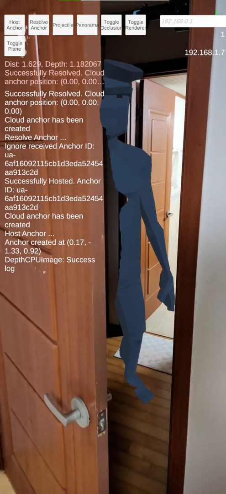
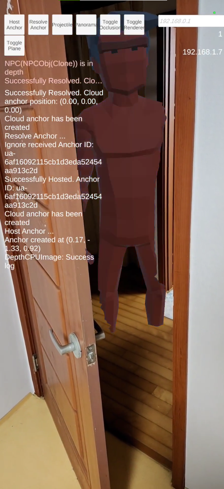
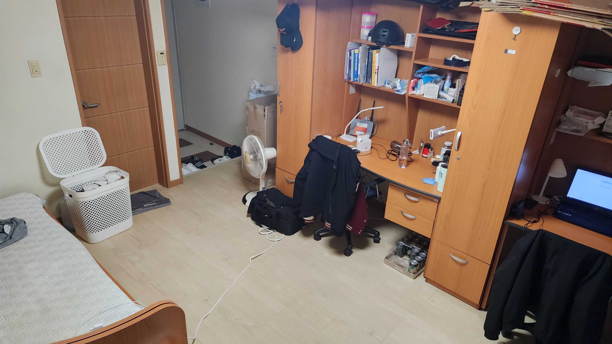
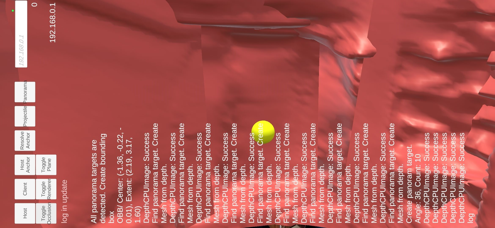
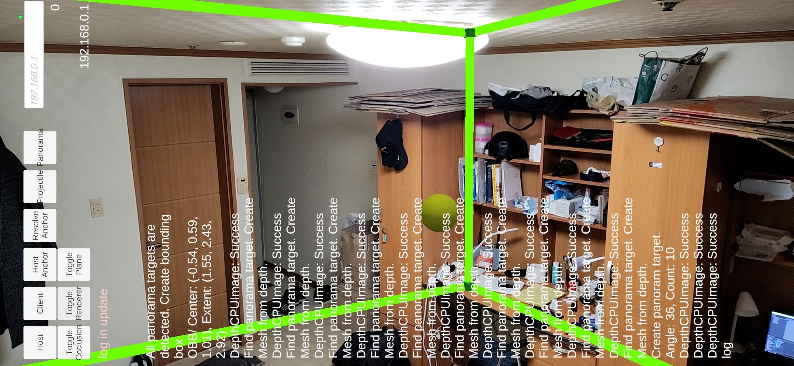

# 현실과의 상호작용을 결합한 증강현실 게임 개발

2022-2 경희대학교 컴퓨터공학과 캡스톤디자인2  
2019102225 전세계

## 개요

현실에서의 동작으로 게임과 상호작용할 수 있고, 주변 환경에 따라 게임 내 환경이 바뀌는 증강현실 게임 시스템을 개발한다.

## 연구 배경 및 필요성

기존 증강현실 게임의 몰입감 부족 원인으로 현실과의 상호작용 부재를 들 수 있다. 이를 해결하기 위해 플레이어의 일상적인 행동이 게임 내에 반영되고 플레이 하는 장소에 따라 게임 환경이 바뀌도록 구현하여 몰입감을 높이고자 한다.

## 연구 내용

증강현실 게임의 몰입감 개선을 위한 다음의 3가지 기능을 개발하였다.
1. 현실의 행동 인식(문과의 상호작용)
2. 주변 환경 추정 및 동적 오브젝트 생성
3. 증강현실 위치 동기화 시스템(멀티플레이)

### 1. 문과의 상호작용 기능

 
문과의 상호작용을 위한 문의 개방 여부 파악 방법으로 Depth Raycast를 사용하였다. 문 뒤에 설치한 Anchor까지의 거리와 해당 방향으로의 Depth 값을 비교하여 문이 열려있는지 여부를 파악한다. Depth값이 Distance보다 크다면 문이 열린 것으로 파악하고 이벤트를 발생시킨다.  

 
NPC가 문에 반쯤 가려진 왼쪽 사진에서는 Distance가 1.629m, Depth가 1.182m로 추정되어 이벤트를 발생시키지 않은 상태이고, NPC가 문에 가려지지 않고 온전히 드러난 오른쪽 사진에서는 이벤트가 발생되어 빨간색으로 변한 것을 확인할 수 있다.
  

### 2. 주변 환경 추정 기능

 

 

 
주변 공간의 크기와 대략적인 모양을 추정하기 위해 Depth Mesh Panorama 기능을 구현하였다. 주변 360도의 Depth 이미지로부터 Mesh를 생성하여 3D로 환경을 재구성하고, Mesh들을 둘러싸는 Bounding Box를 계산하여 대략적인 직육면체 형태의 공간을 추정할 수 있다. 추정된 Bounding Box를 오브젝트를 생성할 위치를 결정하는 데 활용할 수 있다. 
첫 번째 사진의 공간에서 Depth Mesh Panorama를 수행하면 두 번째 사진처럼 Mesh가 형성되고, 이 Mesh들의 Bounding Box를 구하면 세 번째 사진처럼 직육면체 형태의 공간을 얻어낼 수 있다.  

### 3. 증강현실 위치 동기화 기능
Google Cloud Anchor API로 현실의 특정 지점을 공유하여 이를 기준으로 오브젝트의 위치와 방향을 동기화 할 수 있다. 이 기능을 바탕으로 증강현실 멀티플레이어 구현 및 다른 플레이어의 디바이스 위치 추적이 가능하다. 지난 캡스톤디자인1에서 개발된 내용을 모듈화하여 가져온 것으로 자세한 사항은 [캡스톤디자인1 Repository](https://github.com/KHU-Capstone-pARty/pARty)에서 확인할 수 있다.

## 패키지 정보
- Unity 2021.3.10f1
- AR Foundation 4.2.6
- ARCore Extensions 1.33.0
- Netcode for GameObjects 1.0.2

## 참고 문헌
- Depth Mesh 생성 알고리즘
[ARCore Depth Lab](https://github.com/googlesamples/arcore-depth-lab)